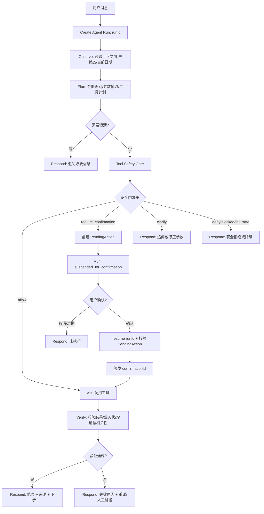

# Campus Agent AI Agent 设计文档

版本：V1.2  
关联文档：[SRS_软件需求规格说明书.md](./SRS_软件需求规格说明书.md)、[API接口设计文档.md](./API接口设计文档.md)

## 1. 设计目标

Campus Agent 的 AI Agent 不是普通聊天机器人，也不是只会把自然语言路由到几个按钮的意图分类器。它是面向校园事务的可观察、可确认、可追溯编排层。核心目标如下：

1. 将用户自然语言目标转化为结构化事务计划。
2. 所有核心任务遵循 `Observe → Plan → Act → Verify → Respond` 闭环。
3. 大模型或规则 Agent 只能提出计划，不能直接执行工具。
4. 所有工具调用必须经过 Tool Safety Gate。
5. 敏感操作必须使用 PendingAction + Agent Run resume 协议，确认前不得执行。
6. 校园知识类问题必须优先使用知识库证据，并按相关性分数规则回答或拒答。
7. Demo 模式下提供脱敏 Judge Mode / Debug Trace，证明系统具备 Agent 闭环而非聊天壳。
8. UI 只能消费 Orchestrator 事件，不得自行伪造阶段、工具调用或安全决策。

## 2. Agent 能力边界

### 2.1 支持能力

| 能力 | 示例 | MVP 要求 |
| --- | --- | --- |
| Observe | 读取“饭卡丢了，帮我挂失”的用户目标、演示账号、上下文 | P0 |
| Plan | 生成“查状态 → 确认 → 挂失 → 验证 → 查补办流程”计划 | P0 |
| 工具选择 | 选择 `schedule.query`、`campus_card.get_status`、`knowledge.search` | P0 |
| 参数抽取 | 从“明天上午有课吗”抽取日期和时间段 | P0 |
| Tool Safety Gate | 阻止未注册工具、非法参数、未确认敏感操作 | P0 |
| Agent Run 状态机 | 跟踪 runId、暂停确认、resume、终态 | P0 |
| PendingAction | 挂失前创建待确认动作，冻结参数哈希并显示风险 | P0 |
| Verify | 挂失后再次确认状态为 `lost`，知识回答校验 `score` | P0 |
| 多轮上下文 | “那怎么补办？”继承上一轮饭卡上下文 | P0 |
| RAG 可信问答 | 图书馆开放时间、校园卡补办流程带来源 | P0 |
| Debug Trace | 展示 phase、intent、tool、safety decision、duration | P0 |

### 2.2 不支持或受限能力

1. 不允许绕过 Tool Registry 直接访问任意 URL。
2. 不允许大模型直接调用 `campus_card.report_loss` 等敏感工具。
3. 不允许编造校园政策、电话、地址、开放时间和办事日期。
4. 不允许在未授权或未确认情况下查询或修改个人敏感数据。
5. 不在回复、Trace 或日志中展示系统 Prompt、密钥、完整请求体、完整学号、完整卡号。
6. MVP 不承诺真实统一认证、真实校园 API、语音输入、完整课表 CRUD 或多 Agent 分工。

## 3. Agent 工作流

统一工作流为：

```text
Observe → Plan → Act → Verify → Respond
```



### 3.1 阶段职责

| 阶段 | 输入 | 输出 | 禁止行为 |
| --- | --- | --- | --- |
| Observe | 用户消息、会话摘要、用户状态、当前日期、Demo 配置 | 标准化上下文 | 读取无关敏感数据 |
| Plan | 标准化上下文、工具注册表 | 结构化计划、澄清问题、风险等级 | 把计划当作已执行结果 |
| Act | 安全门允许的工具调用 | 工具结果或错误 | 绕过安全门调用工具 |
| Verify | 工具结果、业务规则、RAG 证据 | 验证结论、可回答内容 | 工具失败时生成成功话术 |
| Respond | 验证结论、用户可见状态 | 流式回复、来源卡、下一步 | 暴露隐藏推理链 |

Run 状态机：

```text
created → running → completed
created → running → failed
created → running → cancelled
created → running → suspended_for_confirmation → resumed → completed
created → running → suspended_for_confirmation → expired
created → running → suspended_for_confirmation → cancelled
```

规则：

1. `runId` 是一次用户请求的唯一执行标识，所有 toolCall、PendingAction、Trace 事件必须关联它。
2. 进入 `suspended_for_confirmation` 后，Agent 不得继续执行敏感工具。
3. 用户确认必须触发 `resume(runId, pendingActionId)`；不能在单向流式事件里假装已经确认。
4. `resume` 后只能继续原计划中被冻结的后半段，不得重新让模型改写执行参数。

## 4. 意图分类设计

| 意图编码 | 意图名称 | 示例语句 | 目标工具 | MVP |
| --- | --- | --- | --- | --- |
| `schedule_query` | 查询课表 | “我明天上午有课吗” | `schedule.query` | P0 |
| `campus_card_status` | 查询校园卡状态 | “我的饭卡还能用吗” | `campus_card.get_status` | P0 |
| `campus_card_report_loss` | 挂失校园卡 | “饭卡丢了，帮我挂失” | `campus_card.get_status` + `campus_card.report_loss` | P0 |
| `knowledge_qa` | 校园知识问答 | “图书馆今天几点关门” | `knowledge.search` | P0 |
| `procedure_query` | 办事流程查询 | “饭卡怎么补办” | `knowledge.search` | P0 |
| `smalltalk` | 普通聊天 | “你好” | 无工具 | P0 |
| `schedule_mutation` | 修改课表 | “帮我删掉这门课” | `schedule.create/update/delete` | P1 |
| `unknown` | 无法识别 | “帮我处理一下那个” | 澄清问题 | P0 |

## 5. 工具注册协议

每个工具必须在 Tool Registry 中声明名称、描述、输入参数、输出结构、敏感等级、权限要求、确认要求、环境限制和错误码。模型只能引用注册表中的工具名。

```json
{
  "name": "campus_card.report_loss",
  "description": "挂失当前用户绑定的校园卡",
  "sensitive": true,
  "riskLevel": "high",
  "requiredAuth": true,
  "confirmationRequired": true,
  "allowedEnvironments": ["demo", "mock"],
  "inputSchema": {
    "type": "object",
    "properties": {
      "reason": {
        "type": "string",
        "enum": ["lost", "stolen", "unknown"]
      },
      "pendingActionId": {
        "type": "string"
      },
      "confirmationId": {
        "type": "string"
      }
    },
    "required": ["reason", "pendingActionId", "confirmationId"]
  },
  "outputSchema": {
    "type": "object",
    "properties": {
      "status": { "type": "string" },
      "cardIdMasked": { "type": "string" },
      "reportedAt": { "type": "string" },
      "nextSteps": { "type": "array", "items": { "type": "string" } }
    }
  }
}
```

## 6. Tool Safety Gate

Tool Safety Gate 是 Plan 到 Act 的强制边界。它保证“模型提出计划”和“系统执行动作”分离。

### 6.1 检查项

| 检查项 | 规则 | 失败处理 |
| --- | --- | --- |
| 工具白名单 | `toolName` 必须存在于 Tool Registry | `TOOL_NOT_ALLOWED` |
| 环境限制 | 当前 Demo/Mock 环境必须允许该工具 | `TOOL_NOT_ALLOWED` |
| Schema 校验 | 参数必须符合工具 `inputSchema` | `BAD_REQUEST` 或追问 |
| 权限检查 | 需要登录/演示账号时必须满足 | `UNAUTHORIZED` |
| 敏感等级 | `sensitive=true` 必须进入 PendingAction | `CONFIRMATION_REQUIRED` |
| 确认凭证 | `pendingActionId` 与 `confirmationId` 必须有效 | `PENDING_ACTION_EXPIRED` 或 `CONFIRMATION_REQUIRED` |
| 参数冻结 | 执行参数必须与 PendingAction 冻结摘要一致 | `SAFETY_GATE_BLOCKED` |
| 幂等限制 | 已执行动作不得重复执行 | `CONFLICT` |
| 日志脱敏 | Trace 与日志不得含敏感明文 | `SAFETY_GATE_BLOCKED` |

### 6.2 安全门输出

| 输出 | 含义 | 前端表现 |
| --- | --- | --- |
| `allow` | 可以调用工具 | 进入 running 状态 |
| `require_confirmation` | 需要创建或展示 PendingAction | 显示确认卡 |
| `clarify` | 参数或意图不足 | 展示追问 |
| `deny` | 用户无权或业务不允许 | 展示拒绝原因 |
| `blocked` | 安全策略阻断 | 展示安全兜底 |
| `fail_safe` | 不确定时保守失败 | 不执行工具，给人工路径 |

## 7. Prompt 设计要求

### 7.1 系统 Prompt 核心规则

系统 Prompt 应包含以下规则：

1. 你是 Campus Agent，中南民族大学校园事务助手。
2. 你只能输出结构化计划或用户可见回复，不能声称工具已执行。
3. 对校园事务优先使用可用工具。
4. 不确定时必须说明不确定性或请求补充信息。
5. 不得编造官方政策、地点、电话号码、开放时间。
6. 敏感操作必须等待 PendingAction 确认，不得直接执行。
7. 回复应简洁、明确，适合移动端阅读。
8. 不展示隐藏推理链，只展示用户可理解的阶段、工具和证据。

### 7.2 工具计划输入

```json
{
  "userMessage": "饭卡丢了，帮我挂失",
  "conversationSummary": "用户刚打开应用，尚无上下文。",
  "clientContext": {
    "currentDate": "2026-07-07",
    "demoMode": true
  },
  "userState": {
    "isLoggedIn": true,
    "role": "student",
    "studentNoMasked": "2023****018"
  },
  "availableTools": [
    "schedule.query",
    "campus_card.get_status",
    "campus_card.report_loss",
    "knowledge.search"
  ]
}
```

### 7.3 工具计划输出

```json
{
  "intent": "campus_card_report_loss",
  "phase": "plan",
  "steps": [
    {
      "stepId": "step_1",
      "toolName": "campus_card.get_status",
      "parameters": {},
      "requiresConfirmation": false,
      "userVisibleStatus": "我先检查你的校园卡当前状态。"
    },
    {
      "stepId": "step_2",
      "toolName": "campus_card.report_loss",
      "parameters": { "reason": "lost" },
      "requiresConfirmation": true,
      "userVisibleStatus": "如果卡状态正常，我会在你确认后执行挂失。"
    },
    {
      "stepId": "step_3",
      "toolName": "knowledge.search",
      "parameters": { "query": "校园卡补办流程" },
      "requiresConfirmation": false,
      "userVisibleStatus": "挂失完成后，我会查询补办流程。"
    }
  ],
  "clarifyingQuestion": null
}
```

## 8. 上下文管理

### 8.1 上下文内容

| 内容 | 是否进入模型 | 说明 |
| --- | --- | --- |
| 最近用户消息 | 是 | 用于理解当前目标。 |
| 会话摘要 | 是 | 长对话时压缩历史。 |
| 当前事务摘要 | 是 | 例如“上一轮完成校园卡挂失”。 |
| 当前工具结果摘要 | 是 | 用于生成最终回复。 |
| 完整课表 | 否 | 由本地工具筛选后只传必要结果。 |
| 完整学号/卡号 | 否 | 只传脱敏字段或不传。 |
| API Token / 模型密钥 | 否 | 永不进入模型。 |
| PendingAction 冻结参数明文 | 否 | 模型只看到用户可读摘要。 |

### 8.2 多轮上下文示例

第一轮：

```text
用户：饭卡丢了，帮我挂失
系统：已确认校园卡 ****0188 挂失成功。补办流程来自校园知识库，更新时间为 2026-07-01。
```

第二轮：

```text
用户：那怎么补办？
Agent：继承上一轮“校园卡补办”上下文，调用 knowledge.search 查询补办材料和地点。
```

## 9. PendingAction 敏感操作设计

### 9.1 敏感操作清单

| 工具 | 敏感等级 | 必要保护 | MVP |
| --- | ---: | --- | --- |
| `campus_card.report_loss` | 高 | 登录/演示账号、PendingAction、二次确认、执行后验证、操作日志脱敏 | P0 |
| `schedule.delete` | 中 | 删除确认、撤销提示或备份 | P1 |
| `user.clear_data` | 高 | 二次确认、不可恢复提示 | P2 |
| `campus_card.get_status` | 中 | 登录/演示账号、脱敏展示 | P0 |

### 9.2 PendingAction 字段

```json
{
  "pendingActionId": "pa_20260707_001",
  "runId": "run_20260707_001",
  "toolName": "campus_card.report_loss",
  "frozenParamsSummary": {
    "reason": "lost",
    "cardIdMasked": "****0188"
  },
  "frozenParamsCanonicalJson": "{\"reason\":\"lost\",\"target\":\"current_user_card\"}",
  "frozenParamsHash": "sha256:8c7d-demo-hash",
  "riskLevel": "high",
  "warningText": "挂失后校园卡消费、门禁或相关服务可能受限。",
  "expiresAt": "2026-07-07T10:10:00+08:00",
  "status": "pending_confirmation"
}
```

### 9.3 生命周期

```text
pending_confirmation → confirmed → executed
pending_confirmation → cancelled
pending_confirmation → expired
confirmed → failed
```

规则：

1. PendingAction 由 Agent Orchestrator 创建，前端不能自行伪造。
2. 用户确认时提交 `pendingActionId`，系统校验后签发一次性 `confirmationId`。
3. `confirmationId` 只对该 PendingAction、该工具、该 `frozenParamsHash` 有效。
4. PendingAction 过期、取消、执行后不得复用。
5. 用户确认后不再让模型重新解释参数，避免“确认文本”被注入或改写。
6. 工具调用、验证结果、最终回复必须关联同一个 `pendingActionId`。
7. `frozenParamsSummary` 仅用于用户展示，不能作为执行校验依据。
8. `frozenParamsCanonicalJson` 可保存在内存或安全存储中，不展示给用户；Safety Gate 使用其哈希校验参数未被篡改。

### 9.4 确认卡文案要求

校园卡挂失确认卡应包含：

- 操作名称：挂失校园卡。
- 风险等级：高。
- 影响说明：挂失后校园卡消费、门禁或相关服务可能受限。
- 用户信息摘要：演示账号、卡号尾号。
- 过期时间：例如 5 分钟内有效。
- 操作按钮：取消、确认挂失。
- 风险提示：如非本人操作请取消。

## 10. RAG 与知识库问答

### 10.1 知识库字段

| 字段 | 说明 |
| --- | --- |
| knowledgeId | 知识条目唯一 ID。 |
| title | 条目标题。 |
| category | 分类，如图书馆、校园卡、后勤、教务。 |
| content | 正文内容。 |
| source | 来源，如官网、学生手册、模拟数据。 |
| updatedAt | 更新时间。 |
| trustLevel | 可信等级，`official`、`verified`、`demo`。 |
| score | 检索相关性分数，不是真实性概率。 |
| snippet | 命中片段，可选。 |

### 10.2 相关性分数规则

MVP 可采用关键词匹配、标签命中或简化 BM25 生成 `score`。该分数只表示“问题与知识条目的相关程度”，不能包装成“答案真实性 91%”。

| 条件 | Agent 策略 |
| --- | --- |
| `score >= 0.80` | 可直接回答，必须展示来源、更新时间、可信等级。 |
| `0.65 <= score < 0.80` | 可给出“可能相关”的答案，必须提示以官方为准。 |
| `score < 0.65` 或无命中 | 不得给出具体结论，只能说明未找到可靠来源并给人工查询建议。 |
| 多来源冲突 | 优先 `official > verified > demo`；同等级取更新时间更近；仍冲突则提示冲突。 |

### 10.3 回答约束

1. 模型只能基于检索结果中的 `content` 和 `snippet` 生成答案。
2. 不得新增未出现在证据中的电话、地点、时间、政策日期。
3. Demo 数据必须明确标注 `trustLevel=demo`。
4. 最终回复应附带来源卡：标题、来源、更新时间、可信等级、相关性分数。

## 11. 工具结果生成回复

### 11.1 课表查询示例

工具结果：

```json
{
  "toolName": "schedule.query",
  "status": "success",
  "data": {
    "date": "2026-07-08",
    "period": "上午",
    "courses": [
      {
        "name": "高等数学",
        "time": "第1-2节",
        "location": "15号楼 302",
        "teacher": "王老师"
      }
    ]
  },
  "verification": {
    "verified": true,
    "reason": "本地课表筛选结果有效"
  }
}
```

回复：

```text
你明天上午有 1 门课：高等数学，第 1-2 节，在 15 号楼 302，上课老师是王老师。
```

### 11.2 挂失结果示例

回复必须包含：

1. 是否已执行。
2. 是否验证成功。
3. 卡号脱敏摘要。
4. 补办流程来源。
5. 下一步建议。

```text
已为演示账号完成校园卡挂失，卡号尾号 ****0188。系统已再次确认卡状态为 lost。
补办建议：请携带有效证件前往校园卡服务中心办理补卡。
信息来源：校园卡补办流程（demo_knowledge_base，更新时间 2026-07-01）。
```

## 12. 错误与降级策略

| 场景 | Agent 策略 | 用户操作 |
| --- | --- | --- |
| 意图不明确 | 不调用工具，追问具体事项 | 选择查询/挂失/课表等快捷项 |
| 参数缺失 | 追问必要参数 | 补充时间、课程名等 |
| 工具不存在 | Safety Gate 阻断 | 展示“当前不支持该操作” |
| 需要确认 | 创建 PendingAction | 确认或取消 |
| 用户取消 | 标记 cancelled，不执行工具 | 返回聊天 |
| PendingAction 过期 | 标记 expired，不执行工具 | 重新发起 |
| 工具失败 | 基于错误码解释原因 | 重试/人工路径 |
| 模型超时 | 保留已完成工具结果，允许重试摘要 | 重试摘要 |
| 挂失请求超时 | 不直接宣称成功，优先调用 `campus_card.get_status` 验证 | 查看验证结果 |
| 知识库低相关 | 不编造，给官方查询建议 | 查看人工入口 |
| 本地课表为空 | 说明无数据，引导使用演示课表或添加课程 | 使用演示课表 |

## 13. Judge / Debug Trace 设计

Debug Trace 用于比赛演示，不是普通用户默认功能。它只展示 Orchestrator 产生的阶段级事实，不展示隐藏推理链。UI 只能渲染 Trace，不能自行创建 Trace。

### 13.1 Trace 字段

| 字段 | 说明 |
| --- | --- |
| traceId | 当前请求 Trace ID。 |
| runId | 当前 Agent Run ID。 |
| sequence | 同一 Run 内递增事件序号，用于证明阶段顺序。 |
| phase | `observe`、`plan`、`act`、`verify`、`respond`。 |
| intent | 识别到的意图。 |
| toolName | 选择或执行的工具名。 |
| safetyDecision | Safety Gate 输出。 |
| pendingActionId | 如有，展示脱敏 ID。 |
| toolCallId | 工具调用 ID。 |
| evidenceIds | RAG 证据 ID 列表。 |
| evidenceScore | RAG 最高相关性分数。 |
| verificationResult | 验证结论。 |
| stateBefore / stateAfter | Run 或工具状态变化，便于评委确认不是 UI 动画。 |
| durationMs | 阶段耗时。 |
| redactedErrorCode | 脱敏错误码。 |

### 13.2 Trace 禁止项

1. 不展示系统 Prompt。
2. 不展示隐藏推理链。
3. 不展示模型密钥、API Token。
4. 不展示完整学号、完整卡号、手机号、身份证号。
5. 不展示完整工具请求体，只展示摘要。
6. 不允许 UI 生成 Trace 事件；Trace 事件必须来自 Agent Orchestrator 或测试注入的 Orchestrator Mock。

## 14. Agent 验收标准

1. 能稳定执行三条核心 Demo：饭卡挂失、查询课表、查询图书馆时间。
2. 饭卡挂失必须展示“查状态 → PendingAction → 确认 → 执行 → Verify → 补办来源”。
3. 未确认、取消、过期时不会调用 `campus_card.report_loss`。
4. 所有 P0 工具调用均通过 Tool Safety Gate。
5. 对知识库未命中或低相关问题不会编造具体校园信息。
6. 对多轮追问能继承最近一次校园事务上下文。
7. Debug Trace 能证明闭环阶段、工具选择、安全决策和证据来源，且完全脱敏。
8. 需要确认的 Run 必须先进入 `suspended_for_confirmation`，确认后通过 `resume` 执行，不能在同一单向事件流中伪造确认。
