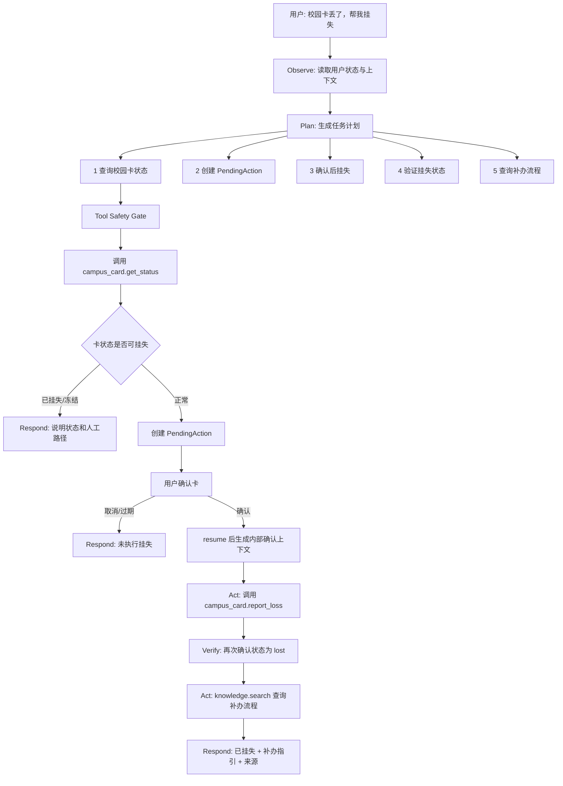
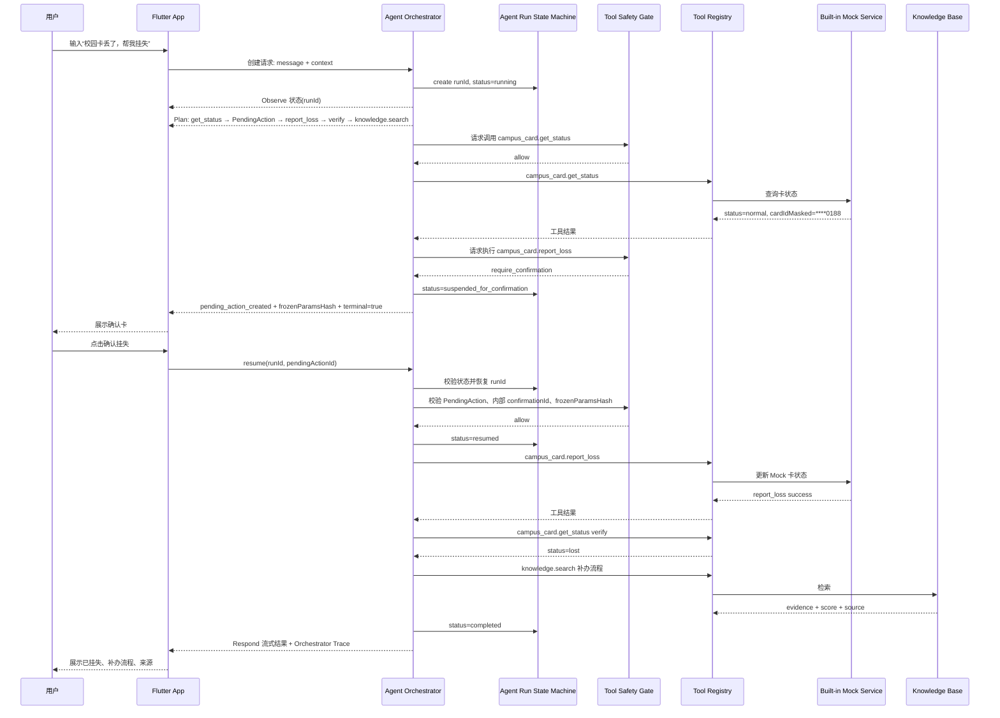
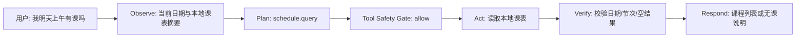

# 《Campus Agent 智能校园助手》产品需求文档 PRD

版本：V1.2  
项目名称：Campus Agent  
目标用户：中南民族大学在校学生与教职工  
核心定位：面向校园事务的可观察、可确认、可追溯 AI Agent，而不是普通聊天机器人。

## 1. 产品概述

### 1.1 产品背景

校园信息服务通常分散在教务系统、校园卡系统、图书馆系统、通知公告平台、后勤服务平台等多个入口。学生和教职工在处理校园事务时，需要频繁切换 App、网页、公众号或人工窗口，既要记住入口，也要判断信息是否可靠。

Campus Agent 的目标不是再做一个“校园问答机器人”，而是把自然语言请求转化为可执行的校园事务流程。用户说出“校园卡丢了，帮我挂失”“我明天上午有课吗”“图书馆今天几点关门”后，系统应能形成可见计划、调用受控工具、等待敏感确认、执行后验证结果，并把来源、状态和下一步清楚反馈给用户。

### 1.2 产品定位

Campus Agent 是一个事务型校园 AI Agent。它遵循统一闭环：

```text
Observe → Plan → Act → Verify → Respond
```

| 阶段 | 含义 | 用户可见价值 |
| --- | --- | --- |
| Observe | 接收用户请求、上下文、登录态、本地数据摘要 | 系统知道“我现在要解决什么问题” |
| Plan | 生成结构化计划，选择工具，判断是否需要确认 | 用户看到 Agent 不是瞎聊，而是在规划步骤 |
| Act | 经过 Tool Safety Gate 后调用本地工具或 Mock API | 工具调用可控、可审计 |
| Verify | 校验工具结果、业务状态、来源、可信等级与相关性分数 | 避免“调用完就算成功”的伪闭环 |
| Respond | 流式输出结论、证据、下一步操作 | 用户获得可信、可执行答案 |

### 1.3 核心痛点

| 痛点 | 说明 | Campus Agent 的解决方式 |
| --- | --- | --- |
| 校园服务入口分散 | 用户需要在多个系统之间切换 | 用自然语言统一触发工具链路 |
| 操作路径复杂 | 用户知道目标，不知道入口和步骤 | Agent 生成事务计划并逐步执行 |
| 普通聊天不可信 | 大模型可能编造政策、地点、时间 | RAG 来源卡 + 相关性阈值 + 低相关拒答 |
| 敏感操作风险高 | 挂失、删除等操作不能由模型直接执行 | Tool Safety Gate + PendingAction 二次确认 |
| 等待过程焦虑 | Function Calling 和大模型响应有延迟 | 事务时间线展示“理解/计划/调用/验证”状态 |
| 比赛展示容易像套壳 | 只演文本问答缺少技术辨识度 | 评委 Trace 展示 intent、tool、safety、evidence、duration |

### 1.4 产品目标

1. 用户可以通过文字发起校园事务请求；语音输入作为 P1 增强，不压入 MVP 主链路。
2. Agent 必须通过 `Observe → Plan → Act → Verify → Respond` 闭环处理核心任务。
3. Agent 只能提出工具计划，实际调用必须经过 Tool Safety Gate。
4. 敏感操作必须创建 PendingAction，用户确认前不得调用执行类工具。
5. 校园知识类回答必须展示来源、更新时间、可信等级与相关性分数；低相关或无来源时不得编造。
6. MVP 采用“双演示策略”：Chrome Web + 内置 Mock Service 作为稳定保底演示，Android APK 至少跑通一次完整校园卡闭环并保留截图或录屏。
7. 竞赛答辩时，评委可以通过 Judge Mode / Debug Trace 看见 Agent 的可观察执行轨迹，但看不到隐藏推理链、密钥或敏感明文。
8. UI 只能订阅 Orchestrator 产生的 Trace 事件，不得自行伪造 Agent 阶段、工具状态或安全决策。

### 1.5 MVP 范围

#### P0A 必须完成：最小可获奖闭环

P0A 是 8 月 30 日前必须锁死的范围。宁可 P0A 做得很硬，也不要 P1/P2 做成半截。

| P0A 能力 | 说明 | 成功标准 |
| --- | --- | --- |
| 文本聊天与状态反馈 | 支持文本输入、停止/重试、阶段状态提示 | 用户 500ms 内看到状态反馈 |
| Agent Run 状态机 | `created → running → suspended_for_confirmation → resumed → completed/failed/cancelled` | Trace 中每个阶段都由 Orchestrator 产生，UI 不得自造阶段 |
| Tool Safety Gate | 工具白名单、Schema 校验、权限/敏感等级、确认检查、参数哈希校验 | 模型不能绕过安全门直接执行工具 |
| PendingAction 确认协议 | 敏感操作先创建待确认动作，确认后通过 `resume` 执行后半段 | 未确认、取消、过期、重复确认均不调用执行工具 |
| 内置 Mock Service | 使用本地 Mock Repository，避免现场后端依赖 | Chrome Web 可离线演示核心链路 |
| 4 个核心工具 | `schedule.query`、`campus_card.get_status`、`campus_card.report_loss`、`knowledge.search` | 三条核心 Demo 均由工具链路完成 |
| 校园卡丢失救援 | 查卡状态 → 创建 PendingAction → 用户确认 → resume → 挂失 → 再查状态 → 补办流程 | 展示复合事务，而不是单次 API 调用 |
| 本地课表查询 | 预置课表 + 自然语言查询 | 支持“我明天上午有课吗” |
| 校园知识问答 | 基于本地知识库返回图书馆、补办流程等答案 | 展示来源、更新时间、trustLevel、score 说明 |
| 失败 UX | 低相关、工具失败、PendingAction 过期、模型摘要超时明确兜底 | 不崩溃、不胡说、不假装成功 |
| Judge Mode | Demo 模式下展示阶段、工具、证据、耗时、脱敏错误码 | 证明“不是普通聊天壳” |
| Android APK 闭环证据 | 构建 Android APK 并完整跑通一次校园卡闭环 | 留存截图或录屏，证明不是纯 Web 项目 |

#### P0B 冲刺增强：P0A 稳定后再做

| P0B 能力 | 说明 | 成功标准 |
| --- | --- | --- |
| 大模型流式文本 | 工具结果已得到后，使用模型生成更自然摘要 | 模型超时时直接展示结构化工具结果 |
| 低相关安全失败 Demo | 通过低相关知识条目演示“不知道就拒答” | 评委能看到系统主动避免幻觉 |
| Judge Mode 微交互 | 阶段节点、Safety Gate、PendingAction 倒计时、Verify 状态变化可视化 | 现场能一眼看出 Agent 在执行事务 |

#### P1 可增强：有余力再做

- 语音输入与语音识别结果编辑。
- 课程新增、编辑、删除、冲突检测。
- 校园卡余额查询与更多卡片信息。
- 会话历史、收藏、最近事务。
- 本地 Mock API Server，用于展示前后端分层能力。
- 图书馆开放时间独立 API `library.get_hours`，但 MVP 优先通过 `knowledge.search` 完成。

#### P2 后续扩展：不承诺比赛前完成

- 真实统一认证系统。
- 真实校园卡、教务、图书馆 API。
- 通知公告聚合与摘要。
- TTS 播报、主动提醒、多 Agent 分工、个性化建议。
- iOS、云同步、服务端 RAG、生产级埋点平台。

## 2. 核心功能看板

### 2.1 功能树

```text
Campus Agent
├── A. Agent 聊天与事务时间线（P0A）
│   ├── 文本输入
│   ├── 流式回复或状态提示
│   ├── Observe / Plan / Act / Verify / Respond 阶段展示
│   ├── 工具调用卡片
│   ├── PendingAction 确认卡
│   ├── 失败兜底与重试
│   └── 评委 Debug Trace（Demo 模式）
│
├── B. 核心工具链路（P0A）
│   ├── schedule.query：本地课表查询
│   ├── campus_card.get_status：校园卡状态查询
│   ├── campus_card.report_loss：校园卡挂失
│   └── knowledge.search：校园知识库检索
│
├── C. 可信校园知识问答（P0A）
│   ├── 图书馆开放时间
│   ├── 校园卡补办流程
│   ├── 办事流程查询
│   ├── 来源 / 更新时间 / trustLevel / score 展示
│   └── 低相关拒答与人工查询建议
│
├── D. 本地课表能力（P0A/P1）
│   ├── 预置课表展示（P0A）
│   ├── 自然语言查课（P0A）
│   ├── 离线查看（P0A）
│   ├── 新增 / 编辑 / 删除（P1）
│   ├── 冲突检测（P1）
│   └── 空闲时间分析（P2）
│
└── E. 增强功能（P1/P2）
    ├── 语音输入（P1）
    ├── 会话历史（P1）
    ├── Mock API Server（P1）
    ├── 通知摘要（P2）
    └── 真实校园系统对接（P2）
```

### 2.2 模块一：Agent 聊天与事务时间线

| 功能 | 优先级 | 用户故事 | 需求说明 |
| --- | ---: | --- | --- |
| 文本输入 | P0A | 用户输入“校园卡丢了，帮我挂失”。 | 支持发送、清空、停止生成、失败重试。 |
| 流式/状态反馈 | P0A | 用户希望系统不要黑屏等待。 | 1.5 秒内出现流式文本或阶段状态。 |
| 事务时间线 | P0A | 用户希望知道 Agent 正在做什么。 | 展示 Observe、Plan、Act、Verify、Respond 阶段。 |
| 工具调用卡片 | P0A | 用户希望知道调用了哪个工具。 | 显示工具名、状态、结果摘要、失败原因。 |
| PendingAction 确认卡 | P0A | 用户在挂失前要明确风险。 | 显示影响、卡号尾号、过期时间、取消/确认按钮。 |
| 评委 Trace | P0A | 评委要确认这不是普通聊天壳。 | Demo 模式展示 intent、tool、safety、evidence、duration。 |
| 语音输入 | P1 | 用户希望边走路边说出需求。 | 语音识别结果可编辑；权限拒绝回退文本。 |

### 2.3 模块二：核心工具链路

| 工具 | 优先级 | 场景 | 规则 |
| --- | ---: | --- | --- |
| `schedule.query` | P0A | “我明天上午有课吗” | 只读取本地课表筛选结果，不把完整课表发给模型。 |
| `campus_card.get_status` | P0A | 挂失前检查卡状态 | 返回脱敏卡号、状态、最近更新时间。 |
| `campus_card.report_loss` | P0A | 用户确认后挂失校园卡 | 只能由 `resume` 后的 Orchestrator 调用，内部携带有效 `pendingActionId`、`confirmationId` 与 `frozenParamsHash`。 |
| `knowledge.search` | P0A | 图书馆时间、补办流程、校园地点 | 返回 `source`、`updatedAt`、`trustLevel`、`score`。 |
| `library.get_hours` | P1 | 独立查询图书馆开放时间 | MVP 不强依赖，可由 `knowledge.search` 覆盖。 |
| `schedule.create/update/delete` | P1 | 完整课表维护 | 删除等敏感本地操作也需确认或撤销。 |

### 2.4 模块三：RAG 可信问答

MVP 的 `score` 只表示本地知识库检索相关性，不表示答案真实概率。若采用关键词检索或简化 BM25，必须在文档和 UI 中说明“score 是相关性分数”。不要把 `0.91` 包装成看似科学的真实性概率。

| 场景 | 规则 |
| --- | --- |
| 高相关命中 | `score >= 0.80`，可直接回答，并展示来源与更新时间。 |
| 中相关命中 | `0.65 <= score < 0.80`，回答时必须提示“可能相关，以官方为准”。 |
| 低相关或无命中 | `score < 0.65` 或无结果，禁止编造具体时间、地点、电话、政策。 |
| 多来源冲突 | 优先 `official > verified > demo`；同等级取更新时间更近；仍冲突则提示冲突。 |
| Demo 数据 | 必须标注 `trustLevel=demo`，不能伪装为真实官方数据。 |

## 3. 用户旅程与核心业务流程

### 3.1 典型用户旅程

| 阶段 | 用户行为 | 系统行为 | 关键体验要求 |
| --- | --- | --- | --- |
| 打开 App | 进入首页 | 展示聊天入口、今日课表、示例指令 | Chrome Web 首屏 1 秒内可交互 |
| 发起请求 | 输入“校园卡丢了，帮我挂失” | Observe 用户目标与上下文 | 输入立即进入执行时间线 |
| 形成计划 | 用户等待 | Plan 出“查状态 → 确认 → 挂失 → 验证 → 补办” | 展示计划，不暴露隐藏推理链 |
| 安全检查 | 系统准备调用工具 | Tool Safety Gate 校验工具、参数、权限 | 敏感操作进入 PendingAction |
| 二次确认 | 用户确认或取消 | 未确认前不得执行挂失 | 确认卡展示风险和过期时间 |
| 执行工具 | 用户等待 | 调用 `campus_card.report_loss` | 展示 Act 状态和 toolCallId |
| 验证结果 | 用户等待 | 再查状态或校验返回结果 | 防止接口超时导致“假成功” |
| 结果反馈 | 查看结果 | Respond 成功/失败、补办流程、来源 | 结果清晰、可追溯、可继续追问 |

### 3.2 “校园卡丢失救援”复合流程图



### 3.3 Agent 工具调用时序图



### 3.4 本地课表查询流程



## 4. 全局非功能性需求

### 4.1 性能与响应速度

| 场景 | 指标 |
| --- | --- |
| Chrome Web 首屏可交互 | 1 秒内完成基础 UI 渲染。 |
| App 冷启动或页面刷新 | 3 秒内进入首页。 |
| 工具状态反馈 | 500ms 内展示“正在理解/正在查询/需要确认”等状态。 |
| 普通问答首字或状态 | 1.5 秒内出现流式内容或阶段状态。 |
| 本地课表查询 | 300ms 内返回结构化结果。 |
| 页面切换动画 | 保持 60fps，避免明显卡顿。 |

### 4.2 Streaming 与事务时间线体验

1. 所有 Agent 回复默认采用流式文本或阶段状态，不能长时间空白等待。
2. 工具调用前应展示用户可理解状态，例如“正在检查校园卡状态”。
3. 工具执行中不展示隐藏推理链，只展示阶段、工具名、状态、证据摘要。
4. 工具失败时不得让模型生成成功口吻；必须说明失败原因和下一步。
5. 工具成功但摘要生成失败时，应直接展示结构化工具结果。
6. 长回复必须分段展示，避免移动端阅读压迫。

等待阶梯：

| 时间 | UI 行为 | 目标 |
| --- | --- | --- |
| 0-500ms | 立即插入用户消息，显示“已收到”或 Observe 状态 | 消除点击无反馈 |
| 500ms-2s | 展示 Plan 或工具准备状态 | 让用户知道系统正在理解 |
| 2-8s | 展示具体工具 running 卡片、耗时、可取消入口 | 降低工具等待焦虑 |
| 8-15s | 展示“继续等待 / 取消 / 重试可重试步骤” | 给用户控制权 |
| 超过 15s | 进入超时兜底，保留已完成工具结果 | 不无限 loading，不丢数据 |

### 4.3 失败 UX 矩阵

| 场景 | 用户可见文案方向 | 主操作 | 禁止行为 |
| --- | --- | --- | --- |
| 意图不明确 | “我不确定你要查询余额还是挂失，请选择。” | 澄清按钮 | 盲目调用工具 |
| 参数缺失 | “还需要课程时间/地点才能添加。” | 补充信息 | 编造参数 |
| 未登录/未授权 | “该操作需要演示账号授权。” | 使用演示账号 | 继续查敏感数据 |
| 需要确认 | “挂失后消费和门禁可能受限，请确认。” | 确认/取消 | 未确认执行 |
| 用户取消 | “已取消，未执行挂失。” | 返回聊天 | 暗中继续执行 |
| PendingAction 过期 | “确认已过期，请重新发起。” | 重新创建 | 复用旧确认 |
| 安全门阻断 | “该工具当前不可用或不允许执行。” | 查看原因 | 暴露系统 Prompt |
| 网络/Mock 不可用 | “服务暂不可用，本地课表仍可查看。” | 重试/人工路径 | 崩溃或无限 loading |
| API 业务冲突 | “校园卡已挂失，无需重复操作。” | 查看补办指引 | 重复执行 |
| 模型超时 | “AI 摘要超时，已保留工具结果。” | 重试摘要 | 丢失已查结果 |
| RAG 低相关 | “本地知识库未找到可靠答案。” | 官方查询入口 | 编造电话/地点/时间 |
| 课表为空 | “当前没有课表数据。” | 使用演示课表/添加课程 | 返回空白 |

### 4.4 UI 与交互风格

| 项目 | 要求 |
| --- | --- |
| 设计风格 | 现代、简洁、轻量科技感，突出“可信校园事务助手”。 |
| 首页结构 | 聊天入口为核心，辅以今日课表、核心 Demo 指令、评委模式开关。 |
| 事务时间线 | 使用逐步点亮的卡片展示 Observe、Plan、Act、Verify、Respond。 |
| 工具结果 | 独立卡片展示工具名、状态、摘要、来源或错误码。 |
| 确认卡 | 高风险操作使用显著视觉层级，显示影响、脱敏信息、过期时间。 |
| 来源卡 | 知识类回答必须展示来源、更新时间、trustLevel、score。 |
| Judge Mode | 左侧保留用户聊天，右侧展示 Agent 飞行记录仪：阶段节点、Safety Gate 决策、PendingAction 倒计时、Verify 状态变化。 |
| 空状态 | 提供示例指令：“校园卡丢了，帮我挂失”“我明天上午有课吗”“图书馆今天几点关门”。 |
| 错误状态 | 给出原因、下一步操作和是否已执行工具。 |

### 4.5 安全与隐私

1. 校园卡挂失、用户身份、课表删除等敏感操作必须经过 PendingAction。
2. Tool Safety Gate 是模型计划到工具执行之间的强制边界。
3. 本地课表、用户偏好、会话摘要应存储在本地安全区域；MVP 可先使用本地 Mock 数据。
4. API Token、模型密钥、用户凭证不得写入代码仓库、前端日志或 Trace。
5. 日志与 Trace 中不得记录完整学号、身份证号、手机号、校园卡号。
6. 大模型请求前应最小化上下文，不发送完整课表、完整卡号或 Token。
7. Debug Trace 只展示阶段级信息，不展示隐藏推理链。
8. Debug Trace、事务时间线和工具卡片只能由 Agent Orchestrator 事件驱动；UI 不得自行合成“看起来执行过”的阶段。

### 4.6 兼容性与运行约束

| 项目 | 要求 |
| --- | --- |
| 首选演示平台 | Chrome Web + 内置 Mock Service。 |
| 备选交付平台 | Android APK。 |
| 可选工程展示 | 本地 Mock API Server。 |
| iOS / Windows Desktop | 后续扩展，不作为 MVP 验收项。 |
| 网络异常 | 核心本地课表与内置 Mock Demo 可继续演示。 |
| 字体适配 | 支持常见系统字体缩放，核心按钮不溢出。 |
| 无障碍 | 主要按钮、输入框、确认卡需有语义标签。 |

### 4.7 竞赛展示要求

竞赛现场不只演“三句问答”，而是演“复合事务闭环”。

#### Demo 1：校园卡丢失救援

指令：

```text
校园卡丢了，帮我挂失
```

必须展示：

1. Agent 计划：查状态 → 创建 PendingAction → resume 后挂失 → 验证状态 → 查询补办流程。
2. Tool Safety Gate：未确认前 `campus_card.report_loss` 不执行。
3. PendingAction 确认卡：显示影响、卡号尾号、过期时间。
4. Agent Run：确认时通过 `resume(runId, pendingActionId)` 继续后半段。
5. Verify：挂失后再次确认卡状态为 `lost`。
6. Respond：返回挂失结果、补办建议、知识库来源。

追问：

```text
那怎么补办？
```

必须展示多轮上下文继承与 `knowledge.search` 来源卡。

#### Demo 2：本地课表查询

指令：

```text
我明天上午有课吗
```

必须展示：`schedule.query`、本地数据查询、空结果/有课结果校验、离线可用。

#### Demo 3：图书馆闭馆时间

指令：

```text
图书馆今天几点关门
```

必须展示：`knowledge.search`、`source`、`updatedAt`、`trustLevel`、`score`，低相关不得编造。

#### Demo 4：安全失败路径

可演示 PendingAction 过期或低相关知识库问题，证明系统会安全拒绝、提示人工路径，而不是胡说或乱执行。

#### 评委可见亮点

1. 事务时间线：让评委看见 Agent 正在 Observe / Plan / Act / Verify / Respond。
2. 安全确认卡：敏感操作不是模型一句话直接执行。
3. 来源卡：校园知识答案可追溯。
4. Debug Trace：展示 intent、tool、safety decision、pendingActionId、evidence score、duration，全部脱敏。
