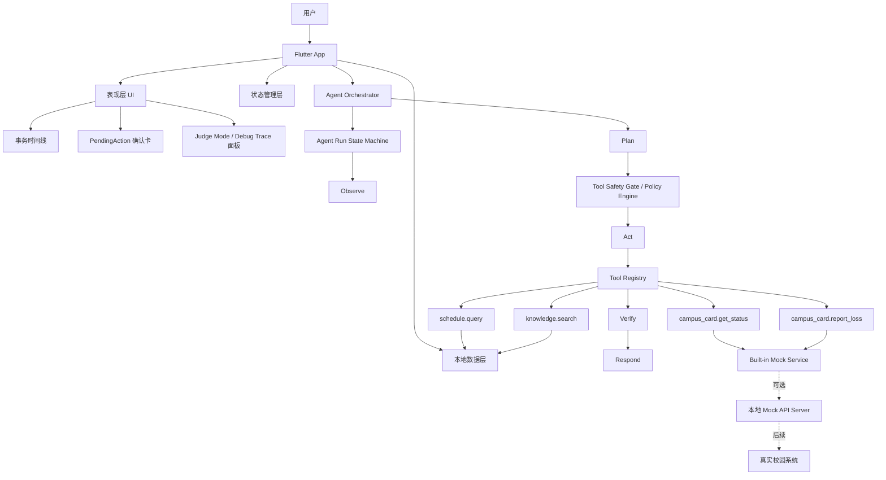
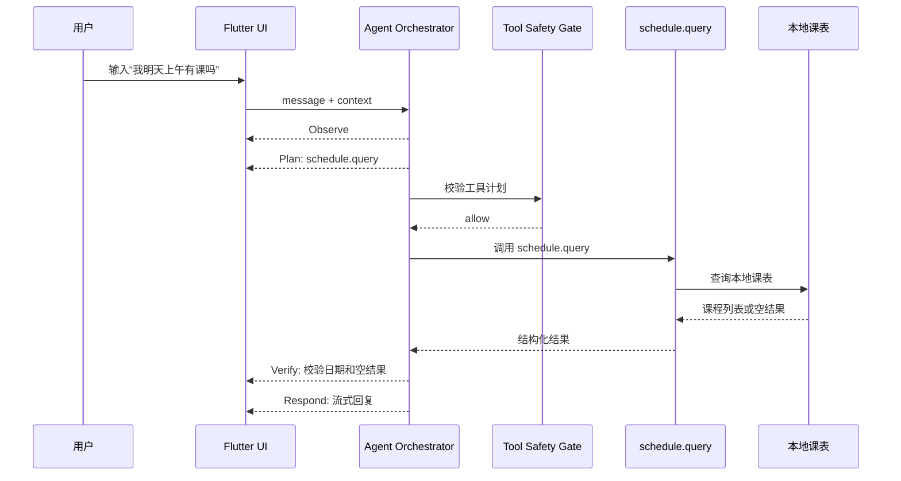
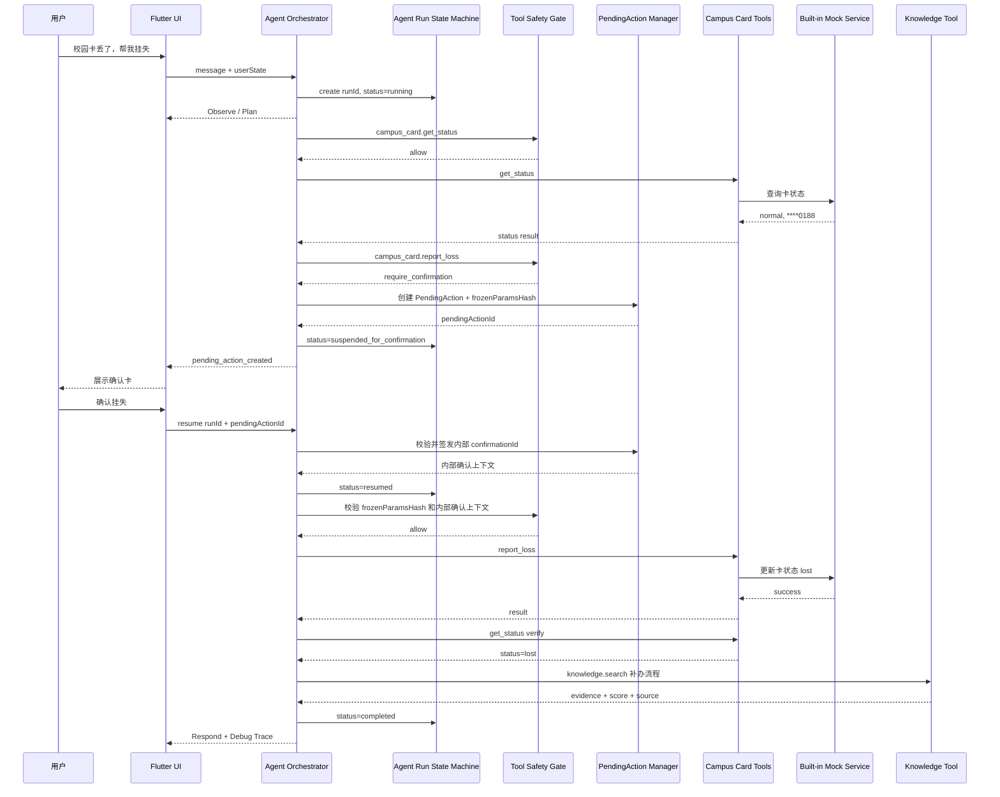

# Campus Agent 系统架构设计

版本：V1.2  
关联文档：[SRS_软件需求规格说明书.md](./SRS_软件需求规格说明书.md)、[AI_Agent设计文档.md](./AI_Agent设计文档.md)、[API接口设计文档.md](./API接口设计文档.md)

## 1. 架构目标

Campus Agent 的架构目标是支持一个可稳定演示、可安全扩展、能明确证明 Agent 闭环的校园事务助手。系统不追求 MVP 阶段接入所有真实校园系统，而是优先跑通“自然语言目标 → 计划 → 安全门 → 工具执行 → 验证 → 可信反馈”的核心链路。

架构目标：

1. Flutter 客户端负责交互、事务时间线、确认卡、工具结果、来源卡和 Judge Mode 展示，但不生成 Trace 事实。
2. Agent Orchestrator 负责 Agent Run 状态机与 `Observe → Plan → Act → Verify → Respond` 编排。
3. Tool Safety Gate 是模型计划与工具执行之间的强制边界。
4. Tool Registry 封装本地课表、校园卡 Mock、校园知识库等 P0A 工具。
5. Built-in Mock Service 是竞赛主演示路径，保证 Chrome Web 可稳定演示。
6. 本地 Mock API Server 仅作为可选工程展示，不作为 MVP 依赖。
7. 安全边界清晰，大模型不能绕过业务规则直接执行敏感操作。

## 2. 总体架构



## 3. 分层设计

### 3.1 表现层

职责：

- 渲染聊天首页、事务时间线、工具结果卡、PendingAction 确认卡、来源卡、错误状态。
- 接收文本输入，P1 再支持语音输入。
- 展示流式回复和阶段状态。
- 处理用户确认、取消、重试、停止等动作。
- Demo 模式下展示脱敏 Debug Trace。

建议页面：

| 页面 | 说明 | MVP |
| --- | --- | --- |
| ChatPage | 核心聊天页，支持输入、流式消息、事务时间线、工具卡片。 | P0A |
| SchedulePage | 本地课表展示与查询结果页。 | P0A |
| DemoTracePanel | 评委模式下展示阶段级 Trace。 | P0A |
| SettingsPage | 演示模式、数据清理、API 配置。 | P1 |
| ToolboxPage | 常用校园工具入口。 | P1 |

### 3.2 状态管理层

职责：

- 管理会话消息列表。
- 管理 Agent Run 状态，只渲染 Orchestrator 事件，不自行生成阶段事实。
- 管理当前工具调用状态。
- 管理 PendingAction 生命周期。
- 管理用户演示账号、权限状态和 Demo 模式。
- 管理课表数据和 Mock 数据刷新。

建议状态对象：

| 状态对象 | 说明 |
| --- | --- |
| ChatState | 消息列表、输入状态、生成状态、当前会话 ID。 |
| AgentRunState | runId、status、currentPhase、intent、suspendedReason、terminalReason。 |
| ToolCallState | toolCallId、toolName、status、durationMs、errorCode。 |
| PendingActionState | pendingActionId、toolName、riskLevel、expiresAt、status、frozenParamsHash。 |
| ScheduleState | 本地课程、选中日期、查询结果。 |
| UserState | 演示用户资料、登录状态、授权状态。 |
| TraceState | Demo 模式下的脱敏事件列表。 |

### 3.3 Agent Orchestrator

职责：

- 为每次用户请求创建 `runId`，维护 Run 状态机：`created`、`running`、`suspended_for_confirmation`、`resumed`、`completed`、`failed`、`cancelled`、`expired`。
- Observe：将用户文本、上下文和本地状态转换为标准 Agent 请求。
- Plan：调用大模型或规则路由生成结构化工具计划。
- 调用 Tool Safety Gate 校验计划。
- 对敏感操作创建 PendingAction，而不是直接调用工具。
- 需要确认时将 Run 暂停为 `suspended_for_confirmation`，用户确认后通过 `resume(runId, pendingActionId)` 继续执行。
- Act：在安全门允许后调用 Tool Registry。
- Verify：校验工具结果、RAG 证据和业务状态。
- Respond：生成用户可读的流式结果和下一步建议。

Agent 层不应直接渲染 UI，也不应绕过 Tool Safety Gate 调用接口。Debug Trace、事务时间线和工具状态必须由 Orchestrator 事件驱动，UI 不得为了展示效果自行伪造阶段。

### 3.4 Tool Safety Gate / Policy Engine

职责：

- 校验工具是否在注册表中。
- 校验工具是否允许在当前环境执行。
- 校验输入参数是否符合 Schema。
- 校验用户登录、授权或演示账号状态。
- 判断是否属于敏感操作。
- 对敏感操作检查 PendingAction、内部 `confirmationId` 和冻结参数哈希。
- 检查规范化冻结参数哈希、幂等性、限流和业务前置条件。
- 保证日志和 Debug Trace 脱敏。

输出：`allow`、`require_confirmation`、`clarify`、`deny`、`blocked`、`fail_safe`。

### 3.5 工具层

职责：

- 封装可被 Agent 调用的 P0A 工具。
- 对输入参数进行二次校验。
- 返回统一结构化结果。
- 将业务错误转换为可展示错误。
- 保证工具结果可供 Verify 阶段验证。

P0A 工具清单：

| 工具名 | 类型 | 说明 |
| --- | --- | --- |
| `schedule.query` | 本地工具 | 查询本地/预置课表。 |
| `campus_card.get_status` | Mock 工具 | 查询脱敏校园卡状态。 |
| `campus_card.report_loss` | Mock 工具 | 挂失校园卡，必须有 PendingAction 确认。 |
| `knowledge.search` | 本地工具 | 检索校园知识库，返回证据与相关性分数。 |

P1/P2 工具：

| 工具名 | 阶段 | 说明 |
| --- | --- | --- |
| `schedule.create` | P1 | 新增课程。 |
| `schedule.update` | P1 | 编辑课程。 |
| `schedule.delete` | P1 | 删除课程，需确认或撤销。 |
| `library.get_hours` | P1 | 独立图书馆开放时间 API，MVP 可由 `knowledge.search` 覆盖。 |
| `notification.search` | P2 | 通知公告检索。 |

### 3.6 数据层

职责：

- 保存本地课表、知识库、会话摘要、工具调用摘要、PendingAction 摘要、用户配置。
- 提供统一 Repository 接口。
- MVP 使用内置 Mock 数据，避免现场服务依赖。
- 后续可从本地数据源替换为 Mock API Server 或真实校园 API。

建议数据源：

| 数据源 | MVP 方案 | 后续方案 |
| --- | --- | --- |
| 课表 | 内置/本地 JSON 或轻量存储 | 教务系统导入 + 本地缓存。 |
| 会话历史 | 当前会话内存态 | 本地加密存储 + 云同步可选。 |
| 校园知识库 | 内置 JSON，带 source/updatedAt/trustLevel/score | 服务端知识库 + RAG 检索。 |
| 校园卡 | Built-in Mock Service | 本地 Mock API Server / 真实校园卡接口。 |
| PendingAction | 本地短期状态 | 服务端签发与审计。 |
| Debug Trace | 本地内存态 | 脱敏日志系统。 |

## 4. 推荐目录结构

MVP 建议采用渐进式架构，先完成纵向闭环，再按模块拆分。不要为了“架构漂亮”牺牲核心 Demo 稳定性。

### 4.1 阶段 1：纵向闭环优先

```text
lib/
├── main.dart
├── app/
│   ├── campus_agent_app.dart
│   └── theme.dart
├── chat/
│   ├── chat_page.dart
│   ├── widgets/
│   │   ├── agent_timeline.dart
│   │   ├── tool_call_card.dart
│   │   ├── pending_action_card.dart
│   │   └── debug_trace_panel.dart
│   └── chat_controller.dart
├── agent/
│   ├── agent_orchestrator.dart
│   ├── tool_safety_gate.dart
│   ├── pending_action_manager.dart
│   ├── tool_registry.dart
│   └── trace_event.dart
├── tools/
│   ├── schedule_query_tool.dart
│   ├── campus_card_tools.dart
│   └── knowledge_search_tool.dart
└── data/
    ├── mock/
    ├── local_schedule_repository.dart
    └── local_knowledge_repository.dart
```

### 4.2 阶段 2：稳定后再拆 features

当 P0A Demo 稳定后，再逐步拆为：

```text
lib/features/chat/
lib/features/schedule/
lib/features/toolbox/
lib/agent/
lib/data/
lib/shared/
```

## 5. 核心业务时序

### 5.1 本地课表查询流程



### 5.2 敏感操作流程



关键约束：确认动作不能在同一条单向事件流里“凭空发生”。无论使用内部事件流、SSE 还是 WebSocket，确认后都必须显式触发 `resume(runId, pendingActionId)`，后半段工具执行只能从 resume 后开始。

## 6. 安全架构

### 6.1 安全边界

| 边界 | 规则 |
| --- | --- |
| UI 到 Agent | UI 提交用户意图、确认结果和交互事件，不直接调用敏感工具。 |
| UI 到 Trace | UI 只能渲染 Orchestrator 事件，不得自行生成 phase、tool、safety、verify 事实。 |
| Agent 到 Safety Gate | Agent 提交结构化计划，由安全门决定是否可执行。 |
| Safety Gate 到 Tool | 只有 `allow` 才能进入 Tool Registry。 |
| PendingAction 到 Tool | 敏感工具必须携带有效 `pendingActionId`、内部 `confirmationId` 和匹配的 `frozenParamsHash`；该凭证不得进入 UI、模型上下文或公开接口。 |
| Tool 到 Mock/API | 工具负责参数校验、业务前置条件和错误转换。 |
| Agent 到模型 | 只发送任务所需最小上下文，不发送完整敏感数据。 |
| Trace 到 UI | 只展示脱敏阶段级事实，不展示隐藏推理链。 |

### 6.2 敏感数据处理

1. 学号、校园卡号、手机号只展示脱敏版本。
2. 操作日志只记录摘要、状态、错误码，不记录完整请求体。
3. API Token、模型密钥不写入代码仓库，不写入前端日志，不进入 Trace。
4. Mock 数据不得使用真实学生信息。
5. PendingAction 中保存用户可见冻结参数摘要和用于校验的规范化参数哈希；摘要不作为安全依据。

## 7. 异常处理架构

| 异常类型 | 处理方式 | Verify / UX 要点 |
| --- | --- | --- |
| 意图不明确 | Agent 追问用户 | 不调用工具。 |
| 工具参数错误 | Safety Gate 返回 clarify 或 BAD_REQUEST | 展示缺失参数。 |
| 权限不足 | 引导演示账号或授权 | 不查敏感数据。 |
| PendingAction 过期 | 标记 expired | 不执行工具，提示重试。 |
| 用户取消 | 标记 cancelled | 不执行工具，明确“未执行”。 |
| 网络异常 | 提示网络不可用 | 本地课表继续可用。 |
| Mock 服务异常 | 提供重试或切换预置数据 | 不崩溃。 |
| 模型超时 | 停止等待，可展示已有工具结果 | 不丢失工具结果。 |
| Run resume 失败 | 保持 `suspended_for_confirmation` 或进入 `failed` | 不执行敏感工具，提示重新确认。 |
| 挂失请求超时 | 调用 `campus_card.get_status` 验证 | 不直接宣称成功。 |
| API 业务失败 | 展示业务原因，例如已挂失 | 提供补办或人工路径。 |
| RAG 低相关 | 不编造，给官方查询建议 | 展示低相关原因。 |
| 本地数据损坏 | 尝试恢复默认数据 | 提示用户重置。 |

## 8. 可扩展设计

1. 新增校园服务时，先注册 Tool，再定义 Safety Gate 策略和测试用例。
2. 替换大模型供应商时，应保持 Agent 输入输出协议不变。
3. Built-in Mock Service、Mock API Server、真实 API 应共享相同 DTO。
4. 课表数据源可从本地预置扩展为教务系统导入。
5. 校园知识库可从内置 JSON 扩展为服务端向量检索。
6. PendingAction 可从本地状态扩展为服务端签发，增强审计能力。

## 9. 架构验收标准

1. 聊天页、Agent Orchestrator、Tool Safety Gate、Tool Registry、Mock 数据层职责清晰。
2. P0A 工具 `schedule.query`、`campus_card.get_status`、`campus_card.report_loss`、`knowledge.search` 通过统一接口注册。
3. `campus_card.report_loss` 必须经过 PendingAction，不允许从模型计划直接执行。
4. 校园卡挂失必须包含 Verify 阶段，确认状态变为 `lost`。
5. 知识问答必须展示来源、更新时间、可信等级和相关性分数说明。
6. Debug Trace 能展示阶段级执行轨迹，包含 `runId` 和递增 `sequence`，且完全脱敏。
7. Chrome Web + Built-in Mock Service 能在无外部后端条件下完成完整演示。
8. Android APK 至少跑通一次校园卡挂失闭环，作为移动端交付证据。
